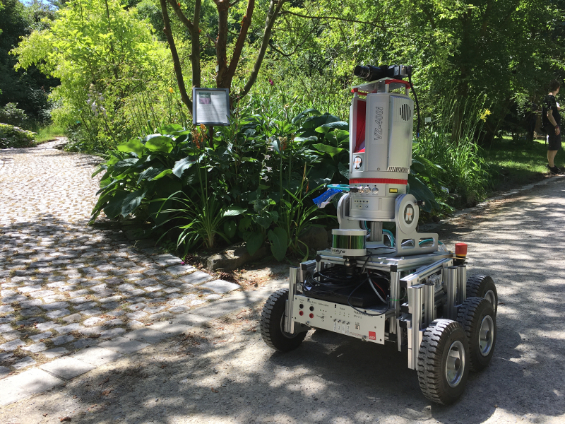
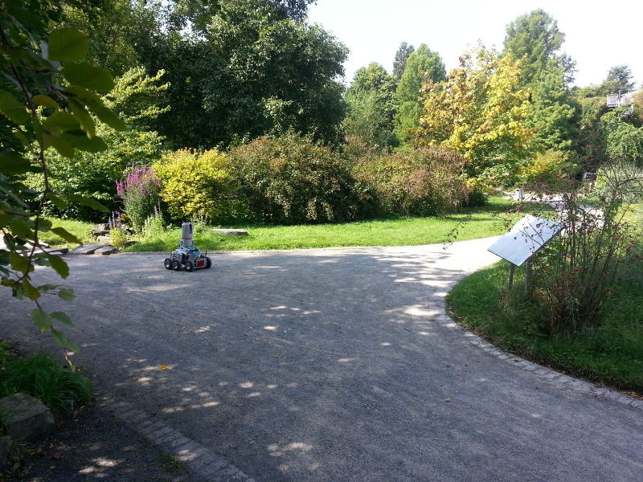

# Pluto Robot
|   |   |
|---|---|
| | |

Maintainer: [Sebastian Pütz](mailto:spuetz@uos.de)  
Author: [Sebastian Pütz](mailto:spuetz@uos.de)

* [Installation](#installation)
* [Software Stack](#software-stack)
* [Simulation](#simulation)
* [Mesh Navigation](#mesh-navigation)
  - [Experiments](#experiments)
  - [How to get our datasets](#how-to-get-our-datasets)
  - [Environmental Datasets](#environment-datasets)

## Installation

Please use the official released ros package or install more recent versions from source.  

`sudo apt install ros-melodic-pluto-robot`

**Installation from source**  
All dependencies can be installed using rosdep  
`rosdep install pluto_robot`

As explicit dependencies for navigation we refer to the following ROS packages, which are also developed by us:
* **[mesh_navigation](https://github.com/uos/mesh_navigation)**
* **[mesh_tools](https://github.com/uos/mesh_tools/)**
* **[move_base_flex](https://github.com/magazino/move_base_flex/)**
* **[lvr2](https://github.com/uos/lvr2)**

## Software Stack
This **[pluto_robot](https://github.com/uos/pluto_robot)** software stack provides software to use the outdoor robot in
simulation and in the real world. Furthermore, example HDF5 map datasets are provided to use *Pluto* with the 
**[mesh_navigation](https://github.com/uos/mesh_navigation)** software stack. This package has been used to evaluate the
mesh navigation stack. Thus, a couple of [experiments](#experiments) are provided.
Additionally mesh navigation path planning and motion control with *Pluto* can be run in the provided 
[Gazebo simulation](#simulation).

This [https://github.com/uos/pluto_robot](pluto_robot) software stack contains the following packages:
* `pluto_bringup` contains a couple of launch and config files to start up the robot with its sensors and drivers.
* `pluto_description` contains the Unified Robot Description Format (URDF) model to model the robot and its internal
transformations
* `pluto_gazebo` contains the *Gezebo* simulation worlds, configurations and launch files to start up the respective 
environments with *Pluto*, see [Simulation](#simulation)
* `pluto_navigation` contains dataset, map and navigation configurations to run the mesh navigation stack with *Pluto*
Additionally, it contains mesh navigation experiments using developed planners from the mesh navigation stack.
See [Mesh Navigation](#mesh-navigation) for more details.
* `pluto_robots` is the corresponding meta package.

## Simulation
You can use Pluto in an outdoor simulation environment. We provides several datasets and the corresponding environments
for the Gazebo simulation. For navigation purposes the corresponding navigation launch file should be started, too. 
The following simulation environments are currently available:

- Botanical Garden at Osnabrück University: `roslaunch pluto_gazebo pluto_botanical_garden.launch`
- Stone Quarry in the Forest in Brockum: `roslaunch pluto_gazebo pluto_stone_quarry.launch`
- Physics building at Osnabrück University: `roslaunch pluto_gazebo pluto_physics.launch`

## Mesh Navigation

The [mesh_navigation](https://github.com/uos/mesh_navigation) stack provides a navigation server for 
[Move Base Flex](https://github.com/magazino/move_base_flex). It provides a couple of configuration files and launch 
files to start the navigation server with the configured layer plugins for the layered mesh map, and the configured
planners and controller to perform path planning and motion control in 3D (or more specifically on 2D-manifold). 

See the Demo Video:  
[](http://www.youtube.com/watch?v=qAUWTiqdBM4)

### Experiments

We provide experiments consisting of starting positions and goals to test the navigation. To run an experiment you first need to launch the navigation stack with the chosen [Environment Dataset](#environment-datasets) and then publish the experiments poses:

```bash
roslaunch pluto_navigation experiment.launch experiment:={experiment_name}
```

Replace `{experiment_name}` with the name of the experiment you choose.
Available experiments for each dataset can be found in the [Environment Dataset Section](#environment-datasets) in the description of the correspoiding dataset.

### How to get our datasets

To manage our datasets we use a git extension called "Git Large File Storage" or for short git LFS.
This allows us to keep this repository small while also embedding our datasets inside this repository.

To download our datasets you first need to install [git LFS](https://git-lfs.github.com) on your system.
After installing the git extension you will be able to clone this repository like any other git repository and the datasets will be downloaded.

If you already cloned this repository without having git LFS installed, the dataset files will just be placeholders on your local copy.
To download the datasets you again need to install git LFS on your system.
After installing the Extension you need to install the git LFS configuration locally.
This needs to be ran just once per system and repository inside the directory of your local copy of this repository.

```
git lfs install
```

Now simply fetch all available git LFS resources for your local copy of this repository.
This will download all datasets and make them available locally.

```
git lfs fetch --all
```

### Environment Datasets

The following environment dataset are available:

- Botanical Garden at Osnabrück University:  
  `roslaunch pluto_navigation botanical_garden_osnabrueck.launch`
- Stone Quarry in the forest in Brockum:  
  `roslaunch pluto_navigation stone_quarry_brockum.launch`
- Physics building at Campus Westerberg, Osnabrück University:  
  `roslaunch pluto_navigation physics_campus_westerberg.launch`
- Farmer's Pit in Stemwede:  
  `roslaunch pluto_navigation farmers_pit_stemwede.launch` 
- Market Garden (complete) in Ibbenbüren:  
  `roslaunch pluto_navigation market_garden_ibbenbueren_all.launch`
- Market Garden (beds) in Ibbenbüren:  
  `roslaunch pluto_navigation market_garden_ibbenbueren_inner.launch`

| Dataset                                                   | # Vertices | # Triangles | BB x[m] | BB y[m] | BB z[m] | Overview                                                                                                                                                                            |
|:--------------------------------------------------------- | ----------:| -----------:| -------:| -------:| -------:| ----------------------------------------------------------------------------------------------------------------------------------------------------------------------------------- |
| [Botanical Garden Osnabrück](#botanical-garden-osnabrück) | 714 760    | 1 430 188   | 39.05   | 49.25   | 6.67    |     |
| [Stone Quarry Brockum](#stone-quarry-brockum)             | 992 879    | 1 904 178   | 100.58  | 100.58  | 23.94   |                                 |
| [Physics Campus Westerberg](#physics-campus-westerberg)   | 719 080    | 1 617 772   | 166.02  | 83.61   | 26.33   |             |
| [Farmer's Pit Stemwede](#farmers-pit-stemwede)            | 401 036    | 794 509     | 122.23  | 104.57  | 14.84   |                                 |
| [Market Garden Ibbenbüren All](#market-garden-ibbenbüren) | 1 361 308  | 2 656 283   | 174.33  | 149.61  | 24.58   |  |

#### Botanical Garden Osnabrück

in progress, description coming soon.

##### Experiments

The following experiments are available for the physics campus dataset. For every experiment there is one option to use the dijkstra planner and one option to use the vector field planner (vfp). To run the experiment, follow the instructions from [Experiments](#experiments).

| Name                                                                | Description | Overview                                                                                                                                                                                                                                    |
| ------------------------------------------------------------------- | ----------- | ------------------------------------------------------------------------------------------------------------------------------------------------------------------------------------------------------------------------------------------- |
| **botanical_garden_1_vfp**<br>or<br>**botanical_garden_1_dijkstra** |             |              |
| **botanical_garden_2_vfp**<br>or<br>**botanical_garden_2_dijkstra** |             |  |
| **botanical_garden_3_vfp**<br>or<br>**botanical_garden_3_dijkstra** |             |              |
| **botanical_garden_4_vfp**<br>or<br>**botanical_garden_4_dijkstra** |             |              |

#### Stone Quarry Brockum

in progress, description coming soon.

##### Experiments

The following experiments are available for the physics campus dataset. For every experiment there is one option to use the dijkstra planner and one option to use the vector field planner (vfp). To run the experiment, follow the instructions from [Experiments](#experiments).

| Name                                                         | Description | Overview                                                                                                                                                                                            |
| ------------------------------------------------------------ | ----------- | --------------------------------------------------------------------------------------------------------------------------------------------------------------------------------------------------- |
| **stone_quarry__1_vfp**<br>or<br>**stone_quarry_1_dijkstra** |             |  |
| **stone_quarry_2_vfp**<br>or<br>**stone_quarry_2_dijkstra**  |             |  |
| **stone_quarry_3_vfp**<br>or<br>**stone_quarry_3_dijkstra**  |             |  |
| **stone_quarry_4_vfp**<br>or<br>**stone_quarry_4_dijkstra**  |             |  |

#### Physics Campus Westerberg

in progress, description coming soon.

##### Experiments

The following experiments are available for the physics campus dataset. For every experiment there is one option to use the dijkstra planner and one option to use the vector field planner (vfp). To run the experiment, follow the instructions from [Experiments](#experiments).

| Name                                                             | Description                                                                                                | Overview                                                                                                                                                                                                                |
| ---------------------------------------------------------------- | ---------------------------------------------------------------------------------------------------------- | ----------------------------------------------------------------------------------------------------------------------------------------------------------------------------------------------------------------------- |
| **phyics_campus_1_vfp**<br/>or<br/>**physics_campus_1_dijkstra** | Plan from the entrance of the building through the tunnel to the parking lot below                         |  |
| **phyics_campus_2_vfp**<br/>or<br/>**physics_campus_2_dijkstra** | Like *physics_campus_1*, but with another goal which results in the shortest path not passing the tunnel |  |
| **phyics_campus_3_vfp**<br/>or<br/>**physics_campus_3_dijkstra** | Uses the same starting position as the first examples but the goal is not at the bottom parking lot        |  |

#### Farmer's Pit Stemwede

in progress, description coming soon.

##### Experiments

The following experiments are available for the physics campus dataset. For every experiment there is one option to use the dijkstra planner and one option to use the vector field planner (vfp). To run the experiment, follow the instructions from [Experiments](#experiments).

| Name                                                        | Description | Overview                                                                                                                                                                                            |
| ----------------------------------------------------------- | ----------- | --------------------------------------------------------------------------------------------------------------------------------------------------------------------------------------------------- |
| **farmers_pit_1_vfp**<br/>or<br/>**farmers_pit_1_dijkstra** |             |  |
| **farmers_pit_2_vfp**<br/>or<br/>**farmers_pit_2_dijkstra** |             |  |
| **farmers_pit_3_vfp**<br/>or<br/>**farmers_pit_3_dijkstra** |             |  |
| **farmers_pit_4_vfp**<br/>or<br/>**farmers_pit_4_dijkstra** |             |  |

#### Market Garden Ibbenbüren

in progress, description coming soon.

##### Experiments

The following experiments are available for the physics campus dataset. For every experiment there is one option to use the dijkstra planner and one option to use the vector field planner (vfp). To run the experiment, follow the instructions from [Experiments](#experiments).

| Name                                                                        | Description | Overview                                                                                                                                                                                                                                 |
| --------------------------------------------------------------------------- | ----------- | ---------------------------------------------------------------------------------------------------------------------------------------------------------------------------------------------------------------------------------------- |
| **market_garden_inner_1_vfp**<br/>or<br/>**market_garden_inner_1_dijkstra** |             |  |
